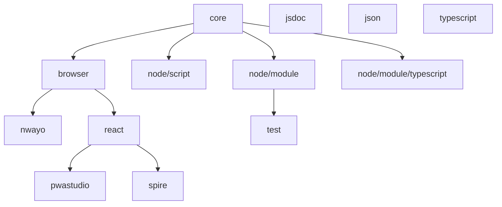

# ESLint config

[![Tests][tests-badge]][tests-url]
[![Lerna][lerna-badge]][lerna-url]

> Opinionated ESLint [shareable configs](https://eslint.org/docs/developer-guide/shareable-configs.html).

## Rulesets

| Package                                                    | Version                                                                                                                                           | Description                                               | Documentation                                                        |
| ---------------------------------------------------------- | ------------------------------------------------------------------------------------------------------------------------------------------------- | --------------------------------------------------------- | -------------------------------------------------------------------- |
| **[@valtech-commerce/eslint-config-core](packages/core)**         | [](https://www.npmjs.com/package/@valtech-commerce/eslint-config-core)             | **Core rules**                                            | [docs](https://valtech-commerce.github.io/eslint-config/core)       |
| [@valtech-commerce/eslint-config-node](packages/node)             | [](https://www.npmjs.com/package/@valtech-commerce/eslint-config-node)             | Node.js rules                                             | [docs](https://valtech-commerce.github.io/eslint-config/node)       |
| [@valtech-commerce/eslint-config-test](packages/test)             | [](https://www.npmjs.com/package/@valtech-commerce/eslint-config-test)             | Testing rules                                             | [docs](https://valtech-commerce.github.io/eslint-config/test)       |
| [@valtech-commerce/eslint-config-browser](packages/browser)       | [](https://www.npmjs.com/package/@valtech-commerce/eslint-config-browser)       | Browser rules                                             | [docs](https://valtech-commerce.github.io/eslint-config/browser)    |
| [@valtech-commerce/eslint-config-nwayo](packages/nwayo)           | [](https://www.npmjs.com/package/@valtech-commerce/eslint-config-nwayo)           | [nwayo](https://documentation.absolunet.com/nwayo/) rules | [docs](https://valtech-commerce.github.io/eslint-config/nwayo)      |
| [@valtech-commerce/eslint-config-react](packages/react)           | [](https://www.npmjs.com/package/@valtech-commerce/eslint-config-react)           | React rules                                               | [docs](https://valtech-commerce.github.io/eslint-config/react)      |
| [@valtech-commerce/eslint-config-jsdoc](packages/jsdoc)           | [](https://www.npmjs.com/package/@valtech-commerce/eslint-config-jsdoc)           | JSDoc rules                                               | [docs](https://valtech-commerce.github.io/eslint-config/jsdoc)      |
| [@valtech-commerce/eslint-config-json](packages/json)             | [](https://www.npmjs.com/package/@valtech-commerce/eslint-config-json)             | JSON rules                                                | [docs](https://valtech-commerce.github.io/eslint-config/json)       |
| [@valtech-commerce/eslint-config-typescript](packages/typescript) | [](https://www.npmjs.com/package/@valtech-commerce/eslint-config-typescript) | TypeScript rules                                          | [docs](https://valtech-commerce.github.io/eslint-config/typescript) |
| -                                                          | -                                                                                                                                                 | -                                                         | -                                                                    |
| [@valtech-commerce/eslint-loader](packages/loader)                | [](https://www.npmjs.com/package/@valtech-commerce/eslint-loader)                       | Config loader                                             | [docs](https://valtech-commerce.github.io/eslint-config/loader)     |

### Dependency tree



## Install

```
$ npm install @valtech-commerce/eslint-config-[RULESET]
```

## Usage

Add some ESLint config to your `.eslintrc.yaml`:

```yaml
extends: "@valtech-commerce/eslint-config-[RULESET]"
```

## Used plugins

- [eslint-plugin-unicorn](https://github.com/sindresorhus/eslint-plugin-unicorn) - Various awesome rules

## Used configuration

- [eslint:recommended](https://eslint.org/docs/latest/user-guide/configuring/configuration-files#using-eslintrecommended) - Recommended rules by ESLint.
- [unicorn/recommended](https://github.com/sindresorhus/eslint-plugin-unicorn#recommended-config) - Recommended rules by unicorn.
- [eslint-config-prettier](https://github.com/prettier/eslint-config-prettier) - Turns off all rules that are unnecessary or might conflict with Prettier.

## Related

- [prettier-config](https://github.com/valtech-commerce/prettier-config) - Opinionated Prettier shareable configs which are used with these ESLint configurations.

## Documentation

See the [full documentation](https://valtech-commerce.github.io/eslint-config) for an in-depth look.

See the [Changelog](CHANGELOG.md) to see what has changed.

## Contribute

See the [Contributing Guidelines](CONTRIBUTING.md) for ways to get started.

See the [Support Guide](SUPPORT.md) for ways to get help.

See the [Security Policy](SECURITY.md) for sharing vulnerability reports.

This project has a [Code of Conduct](CODE_OF_CONDUCT.md).
By interacting with this repository, organization, or community you agree to abide by its terms.

## License

[MIT](LICENSE) © [Valtech Canada inc.](https://www.valtech.ca/)

[tests-badge]: https://github.com/valtech-commerce/eslint-config/workflows/tests/badge.svg?branch=main
[lerna-badge]: https://img.shields.io/badge/maintained%20with-lerna-cc00ff.svg
[tests-url]: https://github.com/valtech-commerce/eslint-config/actions?query=workflow%3Atests+branch%3Amain
[lerna-url]: https://lernajs.io/
