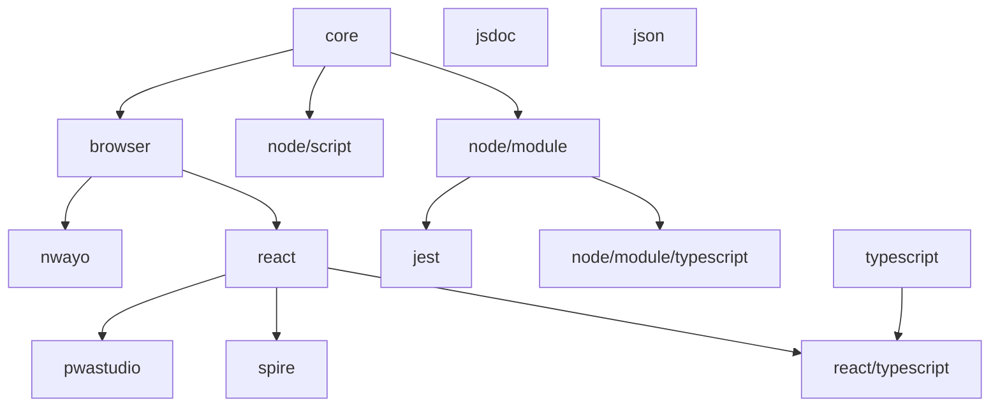

# @valtech-commerce/eslint-config

[![npm][npm-badge]][npm-url]
[![npms.io: Score][npmsio-badge]][npmsio-url]
[![libraries.io: SourceRank][librariesio-badge]][librariesio-url]
[![Tests][tests-badge]][tests-url]
[![License: MIT][license-badge]][license-url]

> Opinionated ESLint [shareable configs](https://eslint.org/docs/developer-guide/shareable-configs.html).

## Rulesets

| Ruleset                                                                | Description                                                                      |
| ---------------------------------------------------------------------- | -------------------------------------------------------------------------------- |
| **[core](shareable-config/core.yaml)**                                 | **Core rules**                                                                   |
| [typescript](shareable-config/typescript.yaml)                         | TypeScript rules                                                                 |
| [node/script](shareable-config/node/script.yaml)                       | Node.js rules in "script" mode                                                   |
| [node/module](shareable-config/node/module.yaml)                       | Node.js rules in "module" mode                                                   |
| [node/module/typescript](shareable-config/node/module-typescript.yaml) | Node.js rules in "module" mode using TypeScript                                  |
| [jest](shareable-config/jest.yaml)                                     | Jest rules                                                                       |
| [browser](shareable-config/browser.yaml)                               | Browser rules                                                                    |
| [nwayo](shareable-config/nwayo.yaml)                                   | [nwayo](https://valtech-commerce.github.io/nwayo/) rules                         |
| [react](shareable-config/react.yaml)                                   | React rules                                                                      |
| [react/typescript](shareable-config/react-typescript.yaml)             | React rules using TypeScript                                                     |
| [jsdoc](shareable-config/jsdoc.yaml)                                   | JSDoc rules                                                                      |
| [json](shareable-config/json.yaml)                                     | JSON rules                                                                       |
| [pwastudio](shareable-config/pwastudio.yaml)                           | [PWA Studio](https://pwastudio.io) rules                                         |
| [spire](shareable-config/spire.yaml)                                   | [Spire](https://www.optimizely.com/products/monetize/configured-commerce/) rules |

### Dependency tree



## Install

```
$ npm install @valtech-commerce/eslint-config
```

## Usage

Add some ESLint config to your `.eslintrc.yaml`:

```yaml
extends: "@valtech-commerce/eslint-config/[RULESET]"
```

## Specifications

### `core`

#### Used plugins / configuration

- [eslint-plugin-unicorn](https://github.com/sindresorhus/eslint-plugin-unicorn) - Various awesome rules
- [eslint:recommended](https://eslint.org/docs/latest/user-guide/configuring/configuration-files#using-eslintrecommended) - Recommended rules by ESLint.
- [unicorn/recommended](https://github.com/sindresorhus/eslint-plugin-unicorn#recommended-config) - Recommended rules by unicorn.
- [eslint-config-prettier](https://github.com/prettier/eslint-config-prettier) - Turns off all rules that are unnecessary or might conflict with Prettier.

### `typescript`

#### Add your tsconfig file to your `.eslintrc.yaml`:

```yaml
parserOptions:
  project:
    - "./tsconfig.json" # Your TS config file
```

#### Used parser / plugin / configuration

- [@typescript-eslint/parser](https://typescript-eslint.io/) - TypeScript parser
- [@typescript-eslint](https://typescript-eslint.io/) - TypeScript linting rules
- [@typescript-eslint/recommended](https://typescript-eslint.io/linting/configs) - Recommended rules for TypeScript
- [@typescript-eslint/recommended-requiring-type-checking](https://typescript-eslint.io/linting/configs) - Require type information rules

### `node/script`

#### Used plugin / configuration

- [eslint-plugin-node](https://github.com/mysticatea/eslint-plugin-node) - Additional ESLint's rules for Node.js
- [node/recommended-script](https://github.com/mysticatea/eslint-plugin-node#-configs) - Recommended rules for Node.js with CommonJS.

### `node/module`

#### Used plugin / configuration

- [eslint-plugin-node](https://github.com/mysticatea/eslint-plugin-node) - Additional ESLint's rules for Node.js
- [node/recommended-module](https://github.com/mysticatea/eslint-plugin-node#-configs) - Recommended rules for Node.js with ESM.
- [import/recommended](https://github.com/import-js/eslint-plugin-import) - Recommended rules for Import.

### `node/module/typescript`

### Add your tsconfig file to your `.eslintrc.yaml`:

```yaml
settings:
  import/resolver:
    typescript:
      project: "./tsconfig.json" # Your TS config file
```

#### Used configuration

- [import/typescript](https://github.com/import-js/eslint-plugin-import) - TypeScript support.

### `jest`

#### Used plugin / configuration

- [eslint-plugin-jest](https://github.com/jest-community/eslint-plugin-jest) - Jest syntax rules
- [jest/recommended](https://github.com/jest-community/eslint-plugin-jest#recommended) - Recommended rules for Jest
- [jest/style](https://github.com/jest-community/eslint-plugin-jest#style) - Style rules for Jest

### `react`

#### Used parser / plugin / configuration

- [@babel/eslint-parser] - For flow
- [eslint-plugin-import] - import/export syntax rules
- [eslint-plugin-jsx-a11y] - Accessibility rules on JSX elements
- [eslint-plugin-ordered-imports] - Sorting and grouping imports
- [eslint-plugin-react] - React
- [eslint-plugin-react-hooks] - Enforces rules for React Hooks
- [airbnb](https://github.com/airbnb/javascript) - Airbnb JavaScript Style Guide
- [airbnb/hooks](https://github.com/airbnb/javascript) - Airbnb JavaScript Style Guide for hooks

[@babel/eslint-parser]: https://github.com/babel/babel/tree/main/eslint/babel-eslint-parser
[eslint-plugin-import]: https://github.com/benmosher/eslint-plugin-import
[eslint-plugin-jsx-a11y]: https://github.com/evcohen/eslint-plugin-jsx-a11y
[eslint-plugin-ordered-imports]: https://github.com/KyleMayes/eslint-plugin-ordered-imports
[eslint-plugin-react]: https://github.com/yannickcr/eslint-plugin-react
[eslint-plugin-react-hooks]: https://github.com/facebook/react/tree/main/packages/eslint-plugin-react-hooks

### `jsdoc`

#### Used plugin / configuration

- [eslint-plugin-jsdoc](https://github.com/gajus/eslint-plugin-jsdoc) - JSDoc linting rules
- [jsdoc/recommended](https://github.com/gajus/eslint-plugin-jsdoc#configuration) - Recommended rules for JSDoc

### `json`

#### Used plugin / configuration

- [eslint-plugin-json](https://github.com/azeemba/eslint-plugin-json) - ESLint plugin for JSON files
- [json/recommended](https://github.com/azeemba/eslint-plugin-json#basic-configuration) - Recommended rules for JSON

### `pwastudio`

#### Used plugin / configuration

- [eslint-plugin-package-json](https://github.com/zetlen/eslint-plugin-package-json) - Rules for valid, consistent, and readable package.json files
- [jsx-a11y/recommended](https://github.com/jsx-eslint/eslint-plugin-jsx-a11y#usage) - Recommended rules for accessibility rules on JSX elements
- [package-json/recommended](https://github.com/zetlen/eslint-plugin-package-json#supported-rules) - Recommended rules for package.json files
- [@magento/eslint-config](https://github.com/magento/magento-eslint) - Recommended rules for PWA Studio

### `spire`

#### Used configuration

- [react/recommended](https://github.com/jsx-eslint/eslint-plugin-react#recommended) - Recommended rules for React.js

## Documentation

See the [Changelog](CHANGELOG.md) to see what has changed.

## Contribute

See the [Contributing Guidelines](CONTRIBUTING.md) for ways to get started.

See the [Support Guide](SUPPORT.md) for ways to get help.

See the [Security Policy](SECURITY.md) for sharing vulnerability reports.

This project has a [Code of Conduct](CODE_OF_CONDUCT.md).
By interacting with this repository, organization, or community you agree to abide by its terms.

## License

[MIT](LICENSE) © [Valtech Canada inc.](https://www.valtech.ca/)

[npm-badge]: https://img.shields.io/npm/v/@valtech-commerce/eslint-config?style=flat-square
[npmsio-badge]: https://img.shields.io/npms-io/final-score/@valtech-commerce/eslint-config?style=flat-square
[librariesio-badge]: https://img.shields.io/librariesio/sourcerank/npm/@valtech-commerce/eslint-config?style=flat-square
[tests-badge]: https://img.shields.io/github/actions/workflow/status/valtech-commerce/eslint-config/tests.yaml?style=flat-square&branch=main
[license-badge]: https://img.shields.io/badge/license-MIT-green?style=flat-square
[npm-url]: https://www.npmjs.com/package/@valtech-commerce/eslint-config
[npmsio-url]: https://npms.io/search?q=%40valtech-commerce%2Feslint-config
[librariesio-url]: https://libraries.io/npm/@valtech-commerce%2Feslint-config
[tests-url]: https://github.com/valtech-commerce/eslint-config/actions/workflows/tests.yaml?query=branch%3Amain
[license-url]: https://opensource.org/licenses/MIT
